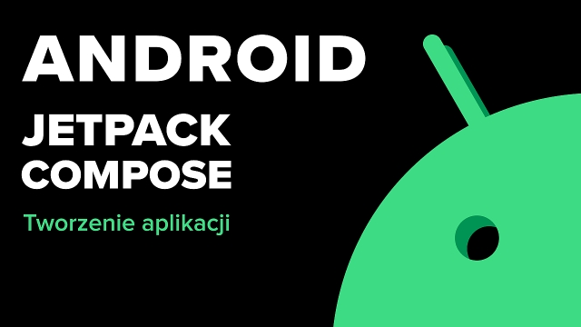
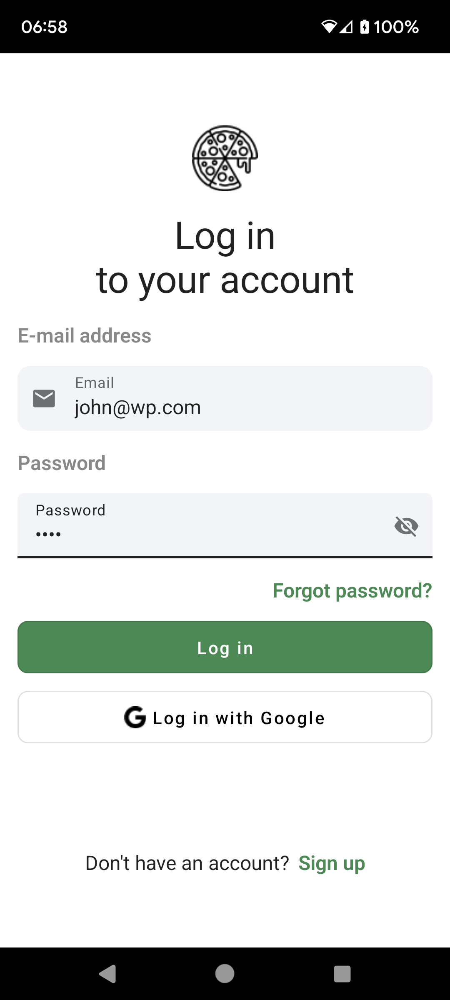

# Noi Quattro

This is strefakursów "[Kurs Tworzenia aplikacji na Androida z Jetpack Compose](https://strefakursow.pl/kursy/programowanie/kurs_tworzenia_aplikacji_na_androida_z_jetpack_compose.html)" training.

 

## Getting Started

Download the project from [Github](https://github.com/Maniak-pl/NoiQuattro), the updated branch is **master**

### Dependencies

This project uses the following dependencies

- [Compose Foundation](https://developer.android.com/jetpack/androidx/releases/compose-foundation)
- [Navigation Compose](https://developer.android.com/jetpack/androidx/releases/navigation)
- [Maps Compose](https://developers.google.com/maps/documentation/android-sdk/maps-compose)
- [Coroutines](https://developer.android.com/kotlin/coroutines)

## Screenshots

  